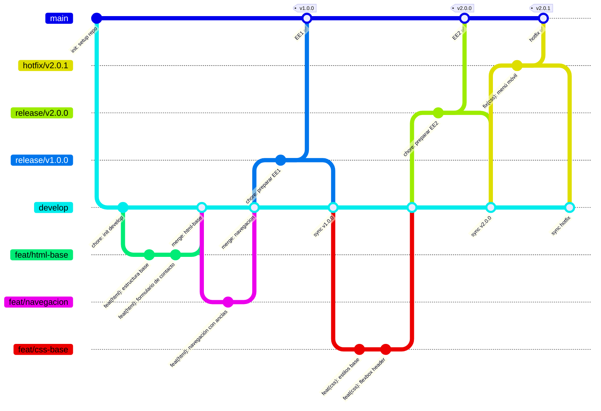

## GitFlow — Modelo del curso



| Rama | Se crea desde | Se fusiona a | Propósito |
|------|--------------|--------------|-----------|
| `main` | — | — | Código estable con tag de versión |
| `develop` | `main` (al inicio) | — | Integración diaria del equipo |
| `feature/*` | `develop` | `develop` | Una funcionalidad específica |
| `release/vX.Y.Z` | `develop` | `main` + `develop` | Preparación del entregable |
| `hotfix/*` | `main` | `main` + `develop` | Corrección urgente en producción |

---

## Reglas críticas

- `main` SOLO recibe merges desde `release/*` o `hotfix/*` — nunca directamente
- `develop` es la rama de trabajo diario del equipo
- `feature/*` siempre se crea desde `develop` y vuelve a `develop`
- `release/*` se crea cuando el EE está listo para entregar
- Al hacer merge a `main`, `release.yml` lee la versión desde el nombre de la rama y crea el GitHub Release automáticamente
- NUNCA hacer commits directos a `main` o `develop` (todo vía PR)
- El CI valida el origen del PR — un `feat/*` hacia `main` fallará la verificación de seguridad

---

## Convención de nombres de ramas

```
tipo/descripción-corta
```

| Tipo | Se crea desde | Se fusiona a | Ejemplo |
|------|--------------|--------------|---------|
| `feat/` | `develop` | `develop` | `feat/seccion-galeria` |
| `fix/` | `develop` | `develop` | `fix/enlace-navbar-roto` |
| `docs/` | `develop` | `develop` | `docs/actualizar-readme` |
| `chore/` | `develop` | `develop` | `chore/organizar-assets` |
| `style/` | `develop` | `develop` | `style/tipografia-base` |
| `release/` | `develop` | `main` + `develop` | `release/v2.0.0` |
| `hotfix/` | `main` | `main` + `develop` | `hotfix/menu-movil-roto` |

### Reglas de nomenclatura

- SIEMPRE minúsculas con guiones `-` (nunca `_` ni espacios)
- SIEMPRE descriptivo y conciso (máx. 4 palabras)
- NUNCA nombres genéricos: `branch1`, `mi-rama`, `cambios`, `test`

---

## Flujo de trabajo — Rama feature (flujo diario)

```bash
# 1. Partir desde un develop actualizado
git checkout develop
git pull origin develop

# 2. Crear rama feature
git checkout -b feat/seccion-galeria

# 3. Desarrollar con commits atómicos
git add index.html
git commit -m "feat(html): agregar estructura de galería de proyectos"

git add css/styles.css
git commit -m "feat(css): implementar CSS Grid para la galería"

# 4. Publicar y abrir PR a develop
git push -u origin feat/seccion-galeria
gh pr create --title "feat: sección galería con CSS Grid" --base develop

# 5. Después del merge, limpiar
git checkout develop
git pull origin develop
git branch -d feat/seccion-galeria
```

---

## Flujo de trabajo — Release (cuando el EE está listo)

```bash
# 1. Asegurarse de que develop tenga todo lo del EE
git checkout develop
git pull origin develop

# 2. Crear rama release
git checkout -b release/v2.0.0

# 3. Ajustes finales (correcciones menores, actualizar README)
git commit -m "chore: preparar release v2.0.0"

# 4. PR a main — el nombre de la rama define la versión
git push -u origin release/v2.0.0
gh pr create --title "chore: release v2.0.0" --base main

# 5. Después del merge → release.yml lee "v2.0.0" del nombre, genera CHANGELOG y crea GitHub Release ✅

# 6. También mergear release de vuelta a develop (para sincronizar correcciones)
gh pr create --title "chore: sync release/v2.0.0 → develop" --base develop

# 7. Limpiar rama release
git branch -d release/v2.0.0
```

---

## Flujo de trabajo — Hotfix (emergencia en producción)

```bash
# 1. Partir desde main (código en producción)
git checkout main
git pull origin main
git checkout -b hotfix/menu-movil-roto

# 2. Corregir y commitear
git add css/styles.css
git commit -m "fix(css): corregir menú colapsado en móvil"

# 3. PR urgente a main
git push -u origin hotfix/menu-movil-roto
gh pr create --title "fix: menú roto en móvil — hotfix" --base main
# release.yml: sin versión en el nombre → PATCH automático desde commits (v2.0.0 → v2.0.1)

# 4. También mergear hotfix a develop
gh pr create --title "fix: sync hotfix → develop" --base develop

# 5. Limpiar
git branch -d hotfix/menu-movil-roto
```

---

## Reglas de protección de ramas

### `main`
GitHub → Settings → Branches → Add rule → `main`:
- Require a pull request before merging ✅
- Require approvals: 1 ✅
- Require branches to be up to date before merging ✅
- Do not allow bypassing the above settings ✅

### `develop`
GitHub → Settings → Branches → Add rule → `develop`:
- Require a pull request before merging ✅
- Require approvals: 1 ✅

---

## Resolución de conflictos

```bash
# Si develop avanzó mientras trabajabas en tu feature
git checkout feat/mi-feature
git merge develop

# Resolver conflictos: buscar marcadores en los archivos
# <<<<<<< HEAD   (tu versión)
# =======
# >>>>>>> develop  (versión de develop)

git add <archivos-resueltos>
git commit -m "chore: merge develop into feat/mi-feature"
```

---

## Mapeo EE → Release

| EE | Versión | Rama release | Cuándo crear |
|----|---------|--------------|-----------   |
| EE1 | `v1.0.0` | `release/v1.0.0` | Semana 4 — HTML completo |
| EE2 | `v2.0.0` | `release/v2.0.0` | Semana 8 — CSS completo |
| EE3 | `v3.0.0` | `release/v3.0.0` | Semana 12 — JS completo |
| EE4 | `v4.0.0` | `release/v4.0.0` | Semana 16 — Entrega final |

---

## Referencia de comandos

```bash
# Ver todas las ramas
git branch -a

# Crear feature desde develop
git checkout develop && git pull origin develop
git checkout -b feat/nombre

# Publicar rama
git push -u origin feat/nombre

# Ver estado del flujo
git log --oneline --graph --all

# Eliminar rama local
git branch -d feat/nombre

# Eliminar rama remota
git push origin --delete feat/nombre
```

---

## Recursos

- **GitHub Actions CI/Release**: Ver [`.github/workflows/ci.yml`](../../.github/workflows/ci.yml) y [`release.yml`](../../.github/workflows/release.yml)
- **Lineamientos EE4**: Ver [`lineamientos-ee4.md`](../../docs/lineamientos/lineamientos-ee4.md)
- **Rúbrica EE4**: Ver [`rubrica-ee4.md`](../../docs/rubrica/rubrica-ee4.md)
- **Guía de contribución**: Ver [`README.md`](../../README.md)
