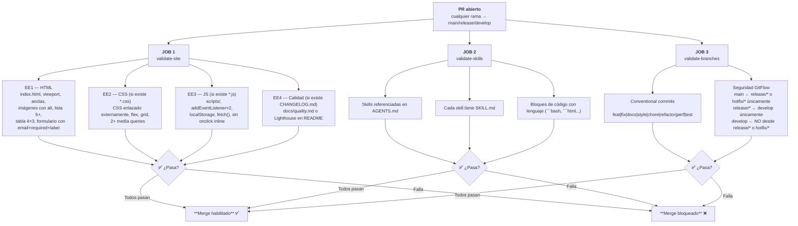
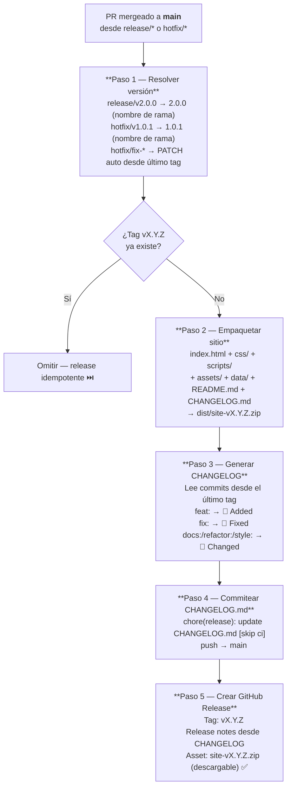

## Workflows

| Archivo | Cuándo se ejecuta | Propósito |
|---------|-------------------|-----------|
| `ci.yml` | Push a `release/**`/`hotfix/**`, PRs a `main`/`release/**`/`develop` | Valida el sitio (EE1–EE4), seguridad de ramas e integridad de skills |
| `release.yml` | PR mergeado a `main`, o manual | Resuelve versión desde nombre de rama, empaqueta y publica GitHub Release |

---

## `ci.yml` — Verificaciones de validación



Se ejecuta en cada PR antes de permitir el merge. Falla si alguna de estas verificaciones no pasa:

| Verificación | Qué valida |
|--------------|-----------|
| Requisitos EE1–EE4 | HTML, CSS, JS y documentación del sitio según lineamientos |
| Conventional commits | Todos los commits del PR siguen `tipo(scope): desc` |
| Seguridad de ramas | El origen del PR respeta las reglas de GitFlow |
| Skills en AGENTS.md | Cada directorio en `skills/` debe estar referenciado |
| SKILL.md presente | Cada skill debe tener su `SKILL.md` |
| Bloques de código con lenguaje | Todo ` ``` ` debe tener un identificador (`bash`, `yaml`, `html`, etc.) |

---

## `release.yml` — Pipeline completo



---

## Reglas críticas

- NUNCA crear tags manualmente — el workflow los crea automáticamente
- NUNCA editar `CHANGELOG.md` a mano — el workflow lo gestiona
- La versión se define por el **nombre de la rama** (`release/v2.0.0` → `v2.0.0`), no por los commits
- Los conventional commits determinan las secciones del CHANGELOG (Added, Fixed, Changed)
- El commit del CHANGELOG incluye `[skip ci]` para evitar loops
- La versión inicial cuando no hay tags previos es `v1.0.0`

---

## Lógica de versionado (bash puro)

```bash
# Prioridad 1 — versión explícita en el nombre de la rama:
# release/v2.0.0  → VERSION=2.0.0
# hotfix/v1.0.1   → VERSION=1.0.1

# Prioridad 2 — PATCH auto para hotfix/* sin versión explícita:
# hotfix/fix-nav  → último tag v1.0.0 → VERSION=1.0.1

# Los commits (feat:, fix:, docs:) NO afectan el número de versión
# Solo determinan las secciones del CHANGELOG (Added, Fixed, Changed)

# Sin commits desde el último tag → omitir (sin release)
```

---

## Mapeo EE → Release

| EE | Rama release | Versión publicada |
|----|--------------|-------------------|
| EE1 | `release/v1.0.0` | `v1.0.0` |
| EE2 | `release/v2.0.0` | `v2.0.0` |
| EE3 | `release/v3.0.0` | `v3.0.0` |
| EE4 | `release/v4.0.0` | `v4.0.0` |

> La versión se define por el **nombre de la rama**, no por el contenido del commit.

---

## Cómo leer el estado del CI

```bash
# Ver ejecuciones recientes
gh run list

# Ver detalles de una ejecución
gh run view <run-id>

# Ver logs completos
gh run view <run-id> --log
```

En GitHub: pestaña **Actions** → seleccionar el workflow → ver las verificaciones.

---

## Resolución de problemas comunes

| Problema | Causa | Solución |
|---------|-------|---------|
| CI falla: conventional commits | Commit con formato incorrecto (ej: `agregar navbar`) | Usar `feat(html): agregar navbar` — ver tipos válidos en el error |
| CI falla: seguridad de ramas | PR con origen incorrecto (ej: `feat/*` → `main`) | Crear `release/*` o `hotfix/*` según corresponda |
| CI falla: skill no en AGENTS.md | Se creó `skills/mi-skill/` sin agregarlo a AGENTS.md | Agregar una fila en `## Skills disponibles` del `AGENTS.md` |
| CI falla: bloque de código sin lenguaje | ` ``` ` sin identificador | Cambiar a ` ```bash `, ` ```html `, ` ```yaml `, etc. |
| Release no se activa | PR cerrado pero no mergeado | Verificar que el PR fue mergeado, no solo cerrado |
| Versión incorrecta | Nombre de rama incorrecto | Usar `release/v2.0.0` para publicar `v2.0.0` — la versión viene del nombre de la rama |
| Release ya existe (skip) | Tag `vX.Y.Z` ya existe | El workflow hace skip automático — es idempotente |

---

## Archivos de workflow

- [`.github/workflows/ci.yml`](../../.github/workflows/ci.yml)
- [`.github/workflows/release.yml`](../../.github/workflows/release.yml)

---

## Recursos

- **Lineamientos EE4**: Ver [`lineamientos-ee4.md`](../../docs/lineamientos/lineamientos-ee4.md)
- **Rúbrica EE4**: Ver [`rubrica-ee4.md`](../../docs/rubrica/rubrica-ee4.md)
- **softprops/action-gh-release**: https://github.com/softprops/action-gh-release
- **Conventional Commits**: https://www.conventionalcommits.org
